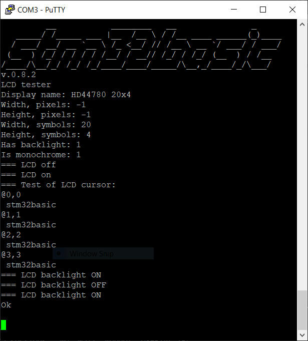

# STM32Basic


## Retro computer with BASIC interpreter (GCC/libopencm3 toolchain version)
Do you have an old PS/2 keyboard? The one that looks so good that you still feel sorry to throw it away? And one of those cheap  HD44780 displays 20x4 or 16x2 symbols. And maybe $1.5 "bluepill" board with STM32F103 microcontroller? 

If so, you can convert it in to an 80's home computer! With BASIC interpreter that supports almost all the usual features, with float and string variables, multi-dimensional arrays, FOR-NEXT, GOSUB-RETURN, etc.

#### See more in the [gallery](https://github.com/vitasam/stm32basic/tree/development/docs/gallery)

#### Based on https://github.com/robinhedwards/ArduinoBASIC
### Technical specs
* MCU: STM32F103C8T6 (72 MHz, 20 KB RAM, 64 KB Flash), a.k.a. "bluepill"
* PS/2 keyboard 
* 20x4 parallel character LCD display (HD44780) 
* SD card
* UART port

### Backlog
* [x] Get SD card working (for saving and loading .BAS files)
* [ ] Update README with OpenOCD functionality
* [x] BASIC: add ABS() function
* [x] BASIC: add SQR() function
* [x] BASIC: add SIN() function
* [x] BASIC: add COS() function
* [x] BASIC: add TAN() function
* [x] Implement Display Host API to make it easier to add new displays
* [ ] Add buzzer support
* [ ] Add DIR and DEL commands for file operations
* [ ] Writing and reading of GPIO from BASIC
* [ ] Implement sctipt (e.g. Python) to convert .BAS files to .TXT and vice versa on a PC
* [ ] Add support for VT100 terminal, so it can output BASIC console to any VT100 compatible terminal
* [ ] Short statetemenst for saving space of 20-char screen, e.g. PRINT -> PR
* [ ] Battery for RTC (time/date file attributes, BASIC operators)
* [ ] 16-Bit 5V I/O Expander with Serial Interface
* [ ] Graphics LCD (e.g. TFT 320 x 240 pixels)

## GIT branches

- **master** - main "production" branch for releases
- **development** - R&D branch
- **dso138_port** - "unofficial" port of stm32basic to DSO138 oscilloscope platform

## Prerequisites

1: STM32F103C8T6 (72 MHz, 20 KB RAM, 64 KB Flash), a.k.a. "bluepill" board. It can also work on more powerfull devices, e.g. STM32F103RET6.

2: A PS/2 Keyboard. See http://playground.arduino.cc/Main/PS2Keyboard for wiring details.

3: Any of standard HD44780 LCDs 20x4 (or 16x2) symbols.

4: Breadboard + wires.

5: ST-link v2 USB adapter.

6: USB-to-COM adapter.

7: (Optional) A Piezoelectric buzzer for keyboard clicks and other sounds.

8: (Optional) SD card slot for breadboards.

## Getting Started
Assuming that the user has Windows PC, the easiest way to build the firmware and flash it in to the stm32 board is as following:

1: Install STM32 ST-LINK [utility](https://www.st.com/en/development-tools/stsw-link004.html) on a Windows PC.

2: Connect ST-Link adapter to stm32 board and verify that the MCU is visible from there.

3: Use any of Ubuntu based hosts machines for making a firmware. E.g. use Windows Subsystem for Linux (WSL) on a Windows 10 or Raspberry Pi as a standalone build machine.

*I especially like the last option because I (as probably many DIYers) do have Raspberri Pi lying around idle, and this is a good chance to convert it in to something useful*. 

### C coding style
- C type of comments `/* */` located immediately after the statement (preferably), in order to keep lines as short as possible (old terminals and smartphones friendly). Most text editors have syntax highlighting, therefore it is not necessary to align comments for the better readability.
- Indentation style: 4 spaces.
- Braces `{ }` are used all the time, even for single statement blocks.
- An opening brace is located on the same line as a statement.
- A closing brace should always belong on a separate line.
- Doxygen type of comments is welcome, but completely optional.

#### Setting up Visual Studio Code Remote development in WSL
In case of Windows PC the most convenient way to work with source files in WSL is to use Visual Studio Code Remote, please follow a [Tutorial](https://code.visualstudio.com/remote-tutorials/wsl/getting-started). 

### Setting up Linux environment and build applications
* Get ARM Toolchain:

`sudo apt-get install gcc-arm-none-eabi binutils-arm-none-eabi gdb-arm-none-eabi`

* Clone this `stm32basic` repository and get libopencm3 library locally:

`git clone https://github.com/vitasam/stm32basic.git`

`cd stm32basic`

`./get_libopencm3.sh`

**Note**: building `libopencm3` library on a Raspberry Pi can take a significant amount of time (e.g. up to 20 minutes).

* Build keyboard hardware test

`cd kbd_test_app`

`make hex V=1`

* Build LCD hardware test

`cd ..` 
`cd lcd_test_app`

`make hex V=1`

* Build SD hardware test

`cd ..` 
`cd sd_test_app`

`make hex V=1`

* Build Stm32Basic application

`cd ..` 
`cd stmbasic_app`

`make hex V=1`

### Sort the hardware out
Arrange all components on a breadboard according to [schematics](https://github.com/vitasam/stm32basic/blob/master/docs/kicad/stm32basic_pc.pdf).

### Program the board
If compilations were successful, then one should have `.hex` binary files available, under each applications folder. Copy them to your Windows machine and use ST-Link utility to program and verify the device.

### Serial traces
To get serial console traces just enable following compilation flag in a `Makefile`:

`DEFS += -DSERIAL_TRACES_ENABLED`

The serial terminal should be set to 115200 bod, 8 bits, 1 stop bit:



## BASIC Language
### BASIC programs
Collection of ready-to-use BASIC [programs](https://github.com/vitasam/stm32basic/tree/development/docs/basic) for the memory card. Copy file to the card and load the program, e.g.:

```
LOAD "NQUEENS"
```

NQUEENS.BAS is a progam used for Calculator Speed [Benchmark](https://www.hpmuseum.org/cgi-sys/cgiwrap/hpmuseum/articles.cgi?read=700) (so called N-Queens Problem). The stm32basic is quite fast for measuring it visually with just one loop. It is better to run e.g. 100 loops and then divide the time by 100. One can modify the code on NQUEENS.BAS as following:
```
45 <press Enter> <- delete line 45 DIM A(9)
12 DIM A(9)
15 FOR X=0 TO 100
205 NEXT X
```
Running of such modified program takes about 56 sec on my system, it gives 0.56 sec. In the above Benchmark list the stm32basic comes between those models:
```
 -       0.586     PB-2000C          DL-Pascal ROM Card 1.2 / Native Compiler / Turbo x2.2
 -       0.550     HP-41CL           Mcode / Turbo20 Mode x19.6
```

### Language Description
##### (based on https://github.com/robinhedwards/ArduinoBASIC)
Variables names can be up to 8 alphanumeric characters but start with a letter e.g. a, bob32
String variable names must end in $ e.g. a$, bob32$
Case is ignored (for all identifiers). BOB32 is the same as Bob32. print is the same as PRINT

Array variables are independent from normal variables. So you can use both:
```
LET a = 5
DIM a(10)
```
There is no ambiguity, since a on its own refers to the simple variable 'a', and a(n) referes to an element of the 'a' array.

```
Arithmetic operators: + - * / MOD
Comparisons: <> (not equals) > >= < <=
Logical: AND, OR, NOT
```

Expressions can be numerical e.g. 5*(3+2), or string "Hello "+"world".
Only the addition operator is supported on strings (plus the functions below).

Commands
```
PRINT <expr>;<expr>... e.g. PRINT "A=";a
LET variable = <expr> e.g. LET A$="Hello".
variable = <expr> e.g. A=5
LIST [start],[end] e.g. LIST or LIST 10,100
RUN [lineNumber]
GOTO lineNumber
REM <comment> e.g. REM ** My Program ***
STOP
CONT (continue from a STOP)
INPUT variable e.g. INPUT a$ or INPUT a(5,3)
IF <expr> THEN cmd e.g. IF a>10 THEN a = 0: GOTO 20
FOR variable = start TO end STEP step
NEXT variable
NEW
GOSUB lineNumber
RETURN
DIM variable(n1,n2...)
CLS
PAUSE milliseconds
POSITION x,y sets the cursor
PIN pinNum, value (0 = low, non-zero = high)
PINMODE pinNum, mode ( 0 = input, 1 = output)
LOAD "filename" (from SD card)
SAVE "filename" (to SD card)
```

"Pseudo-identifiers"
```
INKEY$ - returns (and eats) the last key pressed buffer (non-blocking). e.g. PRINT INKEY$
RND - random number betweeen 0 and 1. e.g. LET a = RND
```

Functions
```
LEN(string) e.g. PRINT LEN("Hello") -> 5
VAL(string) e.g. PRINT VAL("1+2")
INT(number) e.g. INT(1.5)-> 1
ABS(number) e.g. ABS(-4.5)-> 4.1
SQR(number) e.g. SQR(534)-> 23.10844
SIN(number) e.g. SIN(45)-> 0.850904
COS(number) e.g. COS(45)-> 0.525322
TAN(number) e.g. TAN(45)-> 1.619775
STR$(number) e.g. STR$(2) -> "2"
LEFT$(string,n)
RIGHT$(string,n)
MID$(string,start,n)
```
